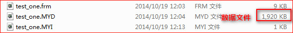
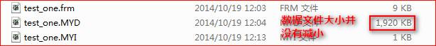
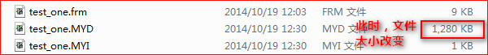
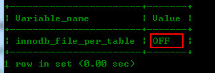
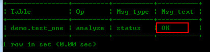

最近，在使用MySQL数据库的MyISAM存储引擎建表，并且在删除大量数据时，发现在本地硬盘放置的的data文件并没有改变大小。碰到这种情况，笔者甚是郁闷而又感到奇怪，经查阅资料，终于解决了该问题。

问题的根源是该数据库表产生了大量的碎片，只要进行碎片整理即可解决问题，现整理如下，方便以后查阅 :)

关键操作：

	OPTIMIZE TABLE 表名;

<!--more-->

现在创建一个MyISAM引擎表`test_one`:

> create table test_one (

>id int unsigned ,

>name varchar(32) not null default ''

>)engine=myisam;

插入测试数据：
	
	insert into test_one values (1, 'test001'),(2, 'test002'),(3, 'test003');
	insert into test_one select * from test_one;  //循环执行这条SQL语句，产生大量数据

现在删除`id=3`的数据：

	delete from test_one where id=3;

执行完毕，查看硬盘数据保存文件大小，看大小是否减为原来的三分之一：

发现，文件大小并没有减小，说明产生了碎片。当使用MyISAM引擎时，可以使用`optimize`命令来优化数据库,进行碎片整理：

	optimize table test_one;

接下来查看硬盘文件大小是否改变：

此时，保存在硬盘的数据文件发生了改变，减小了三分之一，说明使用`optimize`确实进行了碎片整理。

---

也许，会有人问，那假如我使用的是InnoDB引擎建表的呢？

首先，我们要查看`innodb_file_per_table`(是否独享表空间)

	show variables like 'innodb_file_per_table';

OFF代表开启共享表空间没有打开，即采用的是默认的共享表空间。这个时候可以在mysql的datadir路径下看到一个非常大的文件ibdata1，这个文件存储了所有InnoDB表的数据与索引。

如果`test_one`表是InnoDB引擎，当我们执行如下命令：

	optimize table test_one;

此时，会返回`Table does not support optimize, doing recreate + analyze instead`，即代表optimize无法优化表。

这个时候，可以使用如下命令来优化表：

	alter table test_one engine='InnoDB';
	analyze table test_one;

输出如下信息：

另一种情况，如果开启了独享表空间，即每张表都有ibdfile。这个时候如果删除了大量的行，索引会重组并且会释放相应的空间因此不必优化。

---
###小结：

使用`optimize`命令可以进行数据表的碎片整理，从而对表进行优化。

但是要**注意**，OPTIMIZE 操作会暂时锁住表,而且数据量越大,耗费的时间也越长,它毕竟不是简单查询操作.所以把 Optimize 命令放在程序中是不妥当的,不管设置的命中率多低,当访问量增大的时候,整体命中率也会上升,这样肯定会对程序的运行效率造成很大影响.比较好的方式就是做个 Script,定期检查mysql中 `information_schema`.`TABLES`字段,查看 `DATA_FREE` 字段,大于0话,就表示有碎片.脚本多长时间运行一次,可以根据实际情况来定,比如每周跑一次.

（end）