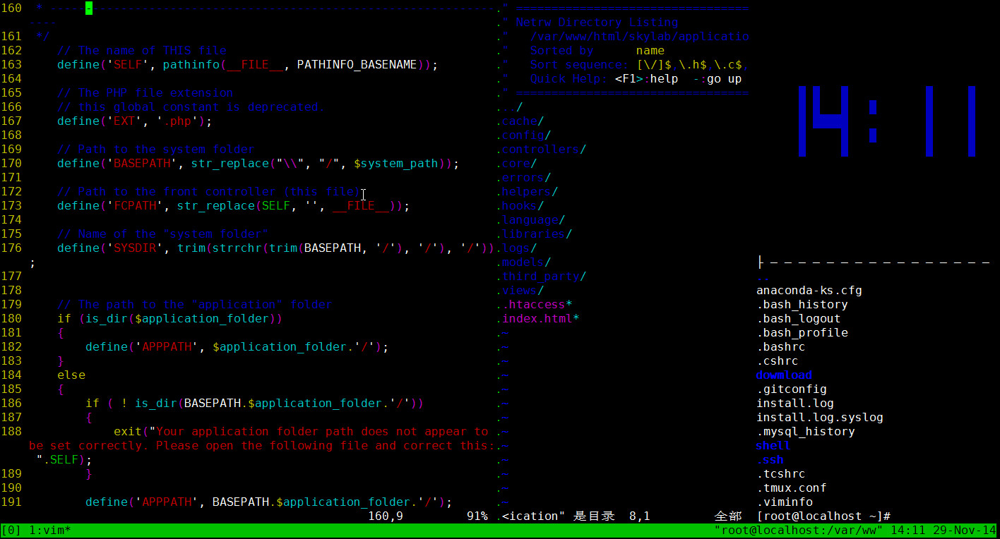

最近，刚接触了命令行神器[Tmux](http://baike.baidu.com/view/9065064.htm?fr=aladdin),然后瞬间被她的神奇所吸引，真是相见很晚啊！！

Tmux是一个优秀的终端复用软件，使用它最直观的好处就是，通过一个终端登录远程主机并运行tmux后，在其中可以开启多个控制台而无需再“浪费”多余的终端来连接这台远程主机；当然其功能远不止于此。

当我们在使用Tmux时，即使非正常掉线，也能保证当前的任务运行，这一点对于远程SSH访问特别有用，网络不好的情况下仍然能保证工作现场不丢失!此外，tmux完全使用键盘控制窗口，实现窗口的切换功能。

<!--more-->

由于刚接触Tmux，还不是特别熟悉，先来截个图炫耀下，哈哈：

下面，我们就先来安装下一定会让你钟情的Tmux。

CentOS官方软件源中没有tmux，如果不想使用EPEL源或者其他第三方源，就要自己编译安装。tmux依赖于ncurses-devel和libevent-devel，我们使用yum安装来解决依赖：

	yum -y install ncurses-devel
	yum -y install libevent-devel

然后，开始安装Tmux：

	wget http://downloads.sourceforge.net/tmux/tmux-1.9a.tar.gz
	tar -zxvf tmux-1.9a.tar.gz
	cd tmux-1.9a
	./configure --prefix=/usr/local/tmux/
	make
	make install

至此，我们Tmux就安装好了，然后把路径添加到PATH环境变量中：

	vim ~/.bashrc
	PATH=${PATH}:/usr/local/tmux/bin/
	source ~/.bashrc

安装完成后输入命令tmux即可打开软件，界面十分简单，类似一个下方带有状态栏的终端控制台；但根据tmux的定义，在开启了tmux服务器后，会首先创建一个会话，而这个会话则会首先创建一个窗口，其中仅包含一个面板；也就是说，这里看到的所谓终端控制台应该称作tmux的一个面板，虽然其使用方法与终端控制台完全相同。

##单元模块

**tmux使用C/S模型构建，主要包括以下单元模块：**

>* server 服务器。输入tmux命令时就开启了一个服务器。
>* session 会话。一个服务器可以包含多个会话。
>* window 窗口。一个会话可以包含多个窗口。
>* panel 面板。一个窗口可以包含多个面板。

不出意外，这时候你会跟我第一次一样，觉得tmux没什么牛逼的，没关系，后面我会慢慢更新博客，详细介绍Tmux的强大之处，你们做好拭目以待了吗？哈哈。。。