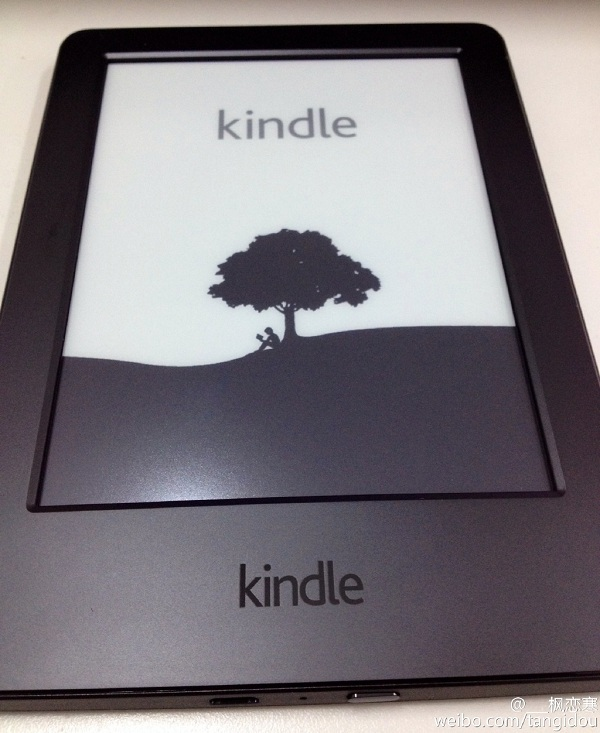

自入手kindle差不多已经一个月了，这将近一个月的阅读体验确实本人感概良多，发现自己更爱读书了，也逐渐喜欢上和离不开 kindle了（推荐给喜欢阅读的小伙伴们~）。其实，早就有写一篇博客来记录这段时间的kindle初体验的想法了，奈何拖延综合症根深蒂固，自己无法自拔。今日早醒，神经恍惚，突然意识到不能再拖延了，于是才有了下面的内容，欢迎拍砖 :)

<!--more-->

##购买kindle之初一二事

其实，早就有听说过kindle的大名了，知道她是为专注阅读而诞生的电子阅读器，最关键的是护眼很棒。又想到自己大学还没毕业、平时课也挺多、还得做项目或者研究前沿技术，除了上课自己几乎整日都把自己关在实验室里，似乎并没有多少时间来阅读，主要是当时自己并不怎么喜欢阅读，整天做技术就已经很累了，没有那个"闲时间"来阅读啥好的东东，于是乎就没有狠心花那几百大洋去给自己买个kindle玩玩了。

就在2015的元旦之初，终于看完了拖延了将近一学期的“闲书”《遇见未知的自己》(张德芬著)，这是一本关于心灵的自身成长小说，自我感觉写的挺好，这里不再赘余书评了，大家可以点击[豆瓣查看](http://book.douban.com/subject/2340100/ )。看完后的当天晚上自己突然头脑一热，意识到我应该读更多的书，想想自从上了大学，到现在都两年半了，发觉自己只读过屈指可数的几本书啊（专业书除外），光想想都觉得羞愧、脸红，要是以后毕业后去面试，别人问我大学都读过哪些书啊、做个评价啊，估计自己除了尴尬就是枉为学生的羞愧了，还好意思说自己是大学生呢，唉~~

当然，上面说到的只是一方面的啦，另外就是恍惚之间觉得不该把自己限制的这么窄，大千世界无奇不有，既然选择了技术这一行当，理所应当每日坚守技术道路，给予大部分时间来提升自己。但是，你要知道，学技术或者钻研啥好东西等等可不是生活的全部啊，如果只是一味地甚至日夜颠倒地做技术，锻炼身体、人际经营、娱乐或其他什么的都抛弃了，只顾闷头做技术，这样的人无疑是弄迷糊了什么是生活（曾经我觉得自己是这样的人呐）、丧失了生活得原本的意义，到最后，自己损害了自己的身体、越来越孤僻、变得不会说话、甚至整日神经兮兮的，想想都觉得可悲，哪怕最后真的学到了高深的技术，却需要这么高的代价，值得吗？看到这，也许会有同行不屑一笑说，“SB，技术才是硬道理...”， “逗*, 像我们这种挨踢屌丝，没得拼爹，只有苦逼似的没日没夜学技术，将来才可能逆袭啊...”等等。首先，我跟大家一样都是同道中人，深知其中苦与乐，记的哪听的一句话，“开心学程序， 快乐过生活”，这句话我曾一直作为自己的qq签名，我不反驳大家的看法，只要开心过、快乐过就够了，这里只保留我个人的看法。

出于以上两点（当然还有其他次要原因）， 我觉得我应该多读书， 并决定以后每个月至少读一本书（现在看来，一本太少了，哈哈~~）， 每天抽出一个小时来读书。其实，我是属于那种比较细腻的人儿，嘿嘿，我怕自己花费太多时间在阅读上，遗漏了技术路线的进度，所以选择在晚上这个时间来看的，差不多我都是晚上九点半从实验室会寝室的，到寝室差不多快十点了，我们学校是晚上十一点断电的（周五六除外），除去洗漱等其他一些杂事，差不多有一个小时来供我睡觉前阅读，哈哈，想想都觉得快哉~~~

所以后来在放寒假前终于入手了心仪已久的kindle阅读器，玩弄了一个下午，差不多功能就已经掌握的差不多了，接下来就按部就班的享受阅读了。

附上一张刚入手时的照片:

##谈谈kindle的使用感受

总的来说，kindle的阅读体验个人觉得蛮好的，这也就是我离不开kindle的原因了，相信你入手后也会很喜欢的，且看下面：

1、**专注阅读**

kindle专注于阅读，就只能阅读，不能听歌、看视频、玩游戏，能浏览网页，但体验性不好。所以后来有人问我kindle怎么怎么样，能不能上qq时，我就想说，你不会看上kindle的，买你的平板去吧。

2、**电子墨水屏幕**

这中显示屏，可以给你带来纸质版的阅读体验，表怀疑，真的跟纸质版相差不多，而且可以根据喜好自行调节字体样式和大小。起初，不太适应kindle每次换页时的一点闪屏，可能用习惯了智能手机的缘故吧，但习惯了就没有闪的感觉了，最后想说这种纸质版的阅读体验真的很赞。

3、**柔和护眼，超长续航**

kindle使用的是电子墨水屏幕，比较护眼，像我们平时如果使用手机或者ipad看电子书，时间一长眼睛就会很累甚至会流泪。kindle就不会出现那种问题，看的时间长了，如果你没有找个舒服的姿势，估计是脖子或者手很累，却不是眼睛很累，这点我还是比较喜欢的。另外就是kindke续航能力太强了，我回家后差不多每天看1-2个小时，用了三个星期左右，你说续航给力不？

4、**单手阅读，轻便做笔记**

kindle为方便单手持握，给屏幕划分了比例，很方便地实现了这个功能。还有就是方便做笔记，也方便查看，并且可以直接存储到云端进行管理。

5、**携带方便**

学挨踢的人都知道，一本《算法导论》那么厚的书，每次回家或者搬家都要塞进背包，一本还可以，多了真的就要命了，是吧，但kindle就可以放下1000多本那么厚的书都没问题，随着电子藏书的日益丰富，还可以建立并命名云端收藏夹，进行图书分类管理。个人分类还可以同步到其他Kindle设备和阅读软件上，海量图书，转瞬即得。

6、......

反正，好处多多，这里权就当给kindle做免费广告了，哈哈~~

##选购图书

有了kindle，剩下的自然就是买书和下载书了。按照习惯，看书一般会根据一些个人博客推荐的书单或平时了解到的，然后去豆瓣看相应的书评来选择，一般8.0以上的就算评价不错的书了。当然，好书太多了，并不是每本好书都适合自己，也不是每本书自己都读得懂，所以还得自己去筛选。

接下来就是购买了，可以在亚马逊上或者多看上购买（我至今还没买过呢，嘿嘿~~），下面推荐一个比较好的免费的kindle电子书网站。

**[读远](http://www.readfar.com/)** 网站，是专门提供给kindle用户的，强烈推荐，这是最棒的kindle电子书网站，各种书籍都有，质量很好，我一般会首先在这里搜索，读远上的书，好像有些是一些书友购买了，然后上传共享的（不知道算不算是盗版的）。而且可以免费下载，更好的是可以直接推送给kindle（这段时间估计停用了，以后应该会重新上线）。

不过，如果真的要是有自己喜欢的书，又没有免费的资源，我也会花银子买下的，要学会给自己投资啊。

---

###小结：

象征性的写个小结。其实，刚开始也害怕自己“浪费”太多时间在阅读上，耽误技术路线的进度，造成不好的结果，后来想想也是多虑了。给自己制定好阅读计划，规划好时间，剩下的就交给坚持吧，事在人为，对吧。

最近看了于娟写的[《此生未完成》](http://book.douban.com/subject/6397275/),说的是作为一位母亲、女儿和妻子在被诊断为乳腺癌后的一年半岁月里的生命日记，在日记中反思生活细节，并发出“买车买房买不来健康”的感叹，引起网友关注和众多媒体热议。对其中一句**"我们要用多大的代价，才能认清活着的意义"**很是难忘,推荐大家有时间的话去看看，看完估计对生命会有不一样的看法和概念。

好吧，就到这里。

(end)