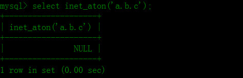

在多数场景下，我们一般在MySQL中存储ip地址时都使用`varchar(15)`或者`char(15)`类型，是吧？
虽说功能是实现了，但是这样构建数据表就能最大限度的优化数据库性能吗？答案是否定的，尽管在存储ip上折腾下不会马上提升系统的性能，但是整个系统架构谁又敢说不是各个地方一点点的优化性能给提升起来了呢？所以说巧存ip也是不可忽略的。

<!--more-->

###如何高效存储ip

答案是使用int(10)类型。

在MySQL中没有专门提供存储ip地址的类型，那我们最容易想到的就是使用`varchar(15)`和`char(15)`了，但这样却不怎么高效，为什么呢？因为使用字符串存储的话首先就会占用至少15个字节，然而使用空间也比较大，假设使用int类型的话只会占用4个字节，占用空间少，检索起来也比字符串速度快很多。

那么，问题来了，我们如何把ip和整型很好地结合起来进行转化呢？幸好mysql已经帮我们实现了这一功能，的确是这样的。mysql中内置了`inet_aton()`和`inet_ntoa()`函数可以让ip地址和整形之间很好的转化。

下面看看mysql手册里的解释吧。

**inet_aton()**
> INET_ATON(expr)

>Given the dotted-quad representation of an IPv4 network address as a
string, returns an integer that represents the numeric value of the
address in network byte order (big endian). INET_ATON() returns NULL if
it does not understand its argument.

**inet_ntoa()**

> INET_NTOA(expr)

>Given a numeric IPv4 network address in network byte order, returns the
dotted-quad string representation of the address as a nonbinary string
in the connection character set. INET_NTOA() returns NULL if it does
not understand its argument.

还是看下实际的例子比较直观：

	> select inet_aton('192.168.1.100');
	

当输入错误的ip地址时会返回NULL:

	> select inet_aton('a.b.c');

当从整型转为ip时就可以使用`inet_ntoa()`函数：

	> select inet_ntoa(3232235876);

当ip不存在时，可以使用0来代替：

	> select inet_ntoa(0);

所以IP的表字段可以设置为INT(10)就好，如果IP获取不到可以直接存0代表获取不到IP的意思.

好了，这也不是什么很高深的东西，单纯做个笔记而已。

(end)