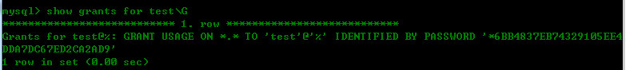
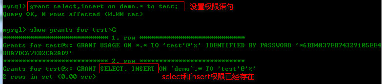

考虑到MySQL数据库的安全，用户应该对他们需要的数据具有适当的访问权，既不能多也不能少。换句话说，用户不能对过多的数据具有过多的访问权。那么现在就MySQL的访问权限问题，做一个小结，如有错误，欢迎拍砖! :)

MySQL默认有一个root的用户帐号，他对整个的MySQL数据库具有完全的访问的控制，在测试中可以使用root帐号(不过并不建议)，但是在实际的应用中，绝不能使用root帐号。我们应该创建一系列的帐号，有的用于管理，有的供用户使用，而有的供开发人员使用，等等~~~

<!--more-->

**再次警告：**

应该严肃对待root登录的使用，尽在绝对需要时才使用它，不要在日常的应用中使用root。创建一系列的帐号，可以保证用户不能执行他们不应该执行的语句，有助于避免mysql受到攻击等情况的发生。

_废话不多说，下面一步步来说明：_

###管理用户

MySQL用户帐号和信息保存在名为mysql的数据库中的user表内。注意，一般不要去访问mysql数据库和里面的表。

	use mysql;
	select * from user;

可以查看user表内的所有用户，其实红user字段保存用户名。

###创建用户帐号

创建一个新用户，使用以下语句：

	create user 用户名 identified by '密码';

例如：

	create user test identified by '123456';

`create user`创建了一个新用户，在创建用户时不一定需要密码，这里使用`identified by '密码'`给出了密码，MySQL将在插入user表之前对其进行加密。

_注意:_

使用grant也可以创建新用户，但是使用create user是最清楚和最简单的方式。也可以是用insert语句来创建新用户，但是为了安全起见，不建议这么做。MySQL用来存储用户帐号信息的，任何的错误都可能导致MYSQL数据崩溃。

###重命名用户帐号

使用以下语句进行用户名的重新命名：

	rename user old_name to new_name;

例如：

	rename user test to new_test;

_注意：_

仅MySQL5之后的版本支持rename user，在MySQL5之前重命名一个用户可以使用update更新User表语句来达到目的。

###删除用户帐号

为了删除用户及其权限，使用以下语句：

	drop user 用户名;

例如：

	drop user test;

_注意：_

自MySQL5以来，使用drop user语句可以删除用户以及相关的权限。但是在MySQL5之前，却只能删除用户，而不能删除该用户的相关权限。因次，必须先使用`revoke` 删除该帐号的权限，然后再删除该用户。

###设置访问权限

在创建新用户后，必须接着分配访问权限。新创建的用户帐号没有访问权限，他们智能登录MySQL数据库，但不能看到数据，不能执行任何的数据库操作。

为了看到用户的权限，使用以下语句：

	show grants for 用户名;

如果没有使用名，即查看的就是自己的权限：

	show grants;  //查看本身权限

下面，我们查看test这个新用户的权限:

	show grants for test;

输出的结果显示用户test有一个权限`USAGE ON *.*`。USAGE表示根本没有权限，所以，此结果在任意数据库和任意表上对任何东西都没有权限。

_注意：_

MySQL的用户权限用用户名和主机名结合定义。如果不指定主机，则使用默认的主机名`%`来代替。

下面，使用grant语句来设置用户一些相关权限：

	grant 要授予的权限 on  被授予权限的数据库或者表 to 用户名;

给用户test设置select和isnert的权限：

	grant select,insert on demo.* to test;
	show grants for test;

此grant语句允许用户test在demo数据库（demo数据库内的所有表）上使用select和insert语句。每个grant添加的权限，MySQL都会读取所有权限，并根据他们确定权限。

_注意：_

可通过列出各个权限并用逗号分割来进行多个grant语句串在一起，从而达到授予多个权限的要求。

那既然给用户test了查询和添加记录的权限，有一天，想把给用户的添加权限给删除掉，怎么办呢？可以受用revoke语句：

	revoke 要删除的权限列表 on 数据库或表 from  用户;

删掉test用户的insert权限：

	revoke insert on demo.* from test;

这条revoke语句取消了test用户的对于demo数据库内的所有表的insert权限，但是要注意，被撤销的权限必须存在，否则会出错。

**grant和revoke可在几个层次上控制访问权限**

>整个服务器,使用`grant all`和`revoke all`

>整个数据库，使用`on database.*`

>特定的表，使用`on database.table`

>特定的列

>特定的存储过程

###更改密码

为了更改用户密码，可以使用`set password`语句：

	set password for 用户名=password('新密码');

这里给test这个用户，更改密码为test123；

	set password for test=password('test123');

`set password`用户更新用户密码，新密码必须传递到`password()`函数内进行加密。

_注意:_

如果`set password`没有指定用户名，即代表的就是设置你自己（当前用户）的密码：

	set password=password('新密码');		//更改自己的新密码

---

###小结：

这里总结了MySQL访问权限的设置问题，在于说明了一个重要的事实，为了MySQL服务器的安全性考虑，你需要给用户提供他们需要的访问权限，且仅提供他们所需的访问权，这样可以在很大程度上保证了MySQL的较高安全性。

另一方面，我们也提到了，在实际的应用上我们不应该使用root帐号，应该创建一系列的帐号来满足不同的需要，尽量不要给出过多的权限。

（end）

	