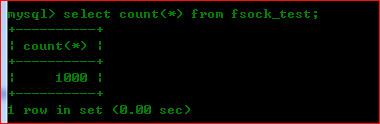

对于php而言本身没有提供多线程这个东西，但是可以通过其他方式做出同样的效果，即一中方式就是使用`fsockopen()`函数和`fwrite()`函数来请求一个url，然后不用等待该返回结果，所以当我们在被请求的那个url中做其他事时就相当于异步了。

特此总结下，php如何模拟异步执行以及笔者在其中遇到的问题，如有错误，欢迎拍砖！ :)

关键代码如下：

	<?php
		$fh = fsockopen('localhost', 80, $errno, $errstr, 5);
		//注意：这里还可以使用POST提交方式
		fwrite($fh, "GET /url_path/***.php\r\nhost: localhost\r\n\r\n");
		fclose($fh);
	?>

<!--more-->

上面的代码向页面 `***.php`发送完请求就不管了，用不着等待请求页面的响应数据，利用这一点就可以在被请求的页面`***.php` 中异步的做些事情了,这就是核心思想。

现在有一个需求，就是当用户访问`one.php`这个页面时，向数据库插入1000条数据（这里假设存在这种需求，当然，实际开发中可能不存在这种情况，也可能是发送1000封电子邮件等等）。

代码实现类似于这样：

	<?php
		//以上有其他操作
		//向数据库模拟插入1000条数据
		for ($i=1; $ <= 1000; $i++) {
			//mysql操作
		}
		echo 'insert ok';
		//到此，可以输出给用户看到添加成功的页面了
	?>

上面实现代码的问题是，用户得等待请求页面的响应数据，而且用户可能要等待很长时间或者由于页面请求超时，而断开连接，这都是造成不好的用户体验的原因。所以，让用户等待是很不友好的，这个插入数据库大量新纪录的过程可以使用异步来完成。

现在，来模拟php异步执行方式，首先创建`one.php`来让用户访问，然后创建`two.php`来实现数据库大量数据操作，同时该页面使用`sleep()`函数来延迟执行。

one.php页面代码：

	<?php
    header('content-type: text/html;charset=utf-8');
    //测试fsockopen异步调用代码
    $start = time();
    $fh = fsockopen('127.0.0.1', 80, $errno, $errstr, 5);
    if (!$fh) { exit($errstr); }
    fwrite($fh, "GET /demo/fsockopen/two.php HTTP/1.1\r\nhost: localhost\r\n\r\n");
    fclose($fh);
    $end = time();
    echo '开始时间：' . $start . ' ';
    echo '结束时间：' . $end;
	?>

two.php页面代码：

	<?php
	sleep(5);	//休眠5秒
    $conn = @mysql_connect('localhost', 'test', '123456');
    if (!$conn) { exit('connect error'); }
    mysql_select_db('demo', $conn);
    for ($i=1; $i<=1000; $i++) {
        $sql = "insert into fsock_test values (null, 'person$i', " .mt_rand(1, 100) . ")";
        $res = mysql_query($sql, $conn);
        if (!$res) {
            exit('error');
        }
    }
    mysql_close($conn);
	?>

显示的消耗时间几乎为零

同时，数据库也插入了1000条数据：
	

从上面的结果可以看出，`two.php`页面至少消耗了5秒以上，但不会阻塞`one.php`的页面执行，表明了该过程是异步的。

---

###注意几点

1、使用`fsockopen()`函数时，第一个参数不能带`http://`字符串，除非使用SSL等。

	 $fh = fsockopen('127.0.0.1', 80, $errno, $errstr, 5);

2、`fwrite（）`函数中可以使用GET请求，也可以使用POST请求

	 fwrite($fh, "GET /demo/fsockopen/two.php HTTP/1.1\r\nhost: localhost\r\n\r\n");		//还可以使用POST请求

3、`\r\n`换行符必须使用双引号来引用，如果使用单引号来引用会当作普通字符串来对待。

