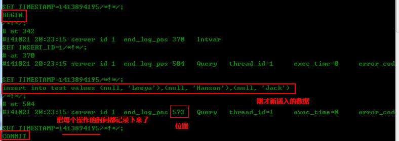

当我们误删了MySQL数据库某张表中的数据或者整张表，我们可以使用MySQL的增量备份机制来实现误删数据的恢复，接下来就来总结下MySQL的增量备份技术是如何实现的，以及其中需要我们注意的事项！

首先，对于ddl和dml语句的二进制备份，我们要清楚的是MySQL在5.0还不支持增量备份，5.1开始支持。

###增量备份的定义

MySQL数据库会以二进制的形式，自动把用户对MySQL数据库的操作，记录到文件夹，当用户希望恢复的时候可以使用备份文件进行恢复。

<!--more-->

下面，我们开始详细说明如何配置增量备份机制。

首先，要实现增量备份，需要在my.ini文件中配置备份路径，我们可以在`[mysqld]`下配置：

	#这里指定把备份文件放在哪个目录下
	log-bin=d:/binlog/mylog

然后重启MySQL服务器即可，增量备份就启动了：

	net stop mysql
	net start mysql

此时会在在`d:\binlog\`下生成两个文件

	mylog.index		//该文件记录索引
	mylog.000001	//该文件记录二进制的详细信息

此时，我们可以使用`mysqlbinlog`工具来查看生成的二进制文件，在cmd中进入mysql目录下的bin中 使用`msyqlbinlog`后面加上`mylog.000001`，可以看到所有**ddl和dml操作(不包括查询操作语句)**，且每一个操作都有具体的位置和时间点的记录。

接下来，创建数据表进行测试：

> create table test(

> id int primary key auto_increment,

> name varchar(32) not null default

>) engine=myisam;

插入数据：

	insert into test values (null, 'Leeya'),(null, 'Hanson'),(null, 'Jack');

切换到mysql下的bin目录，使用`mysqlbinlog`查看二进制文件：

	mysqlbinlog d:\binlog\mylog.000001

结果如下图：

图中已经显示，mysql已经帮我们把每一个操作（**再次提醒：不记录select查询操作**）的时间记录下来了，同时分配了一个位置position，我们就可以根据时间和位置来恢复数据。

下面，我们使用`drop`来删除表;

	drop table test;
此时，数据库中已经不存在test这个数据表了，现在我们可以使用`mysqlbinlog`来进行恢复了。

---

在进行恢复数据之前，先总结下mysql进行恢复数据的两种方式：

###通过时间来恢复

一种是：

	//从开始恢复到这个时间点	
	mysqlbinlog --stop-datetime="2014-10-21 20:39:21" d:/binlog/mylog.000001 | mysql -uroot -p******

另一种是

	//从这个时间点开始恢复到最后
	mysqlbinlog --start-datetime="2014-10-21 20:39:21" d:/binlog/mylog.000001 | mysql -uroot -p******

值得注意的是，时间格式，使用双引号包裹起来。

###通过位置来恢复

一种是：

	//从二进制日志中第1个位置等于N参量时的事件开始读。
	--start-position=N

另一种是:

	//从二进制日志中第1个位置等于和大于N参量时的事件起停止读
	--stop-position=N

下面，我们来进行数据的恢复：

	mysqlbinlog --stop-position="573" d:\binlog\mylog.000001 | mysql -uroot -p******

然后使用sql查看数据是否已经恢复;

	select * from test;

经测试，发现数据的确恢复成功，同理，我们也可以使用时间来恢复数据。

###如何关闭增量备份

把my.ini文件中mysqld下面的`log-bin=路径`前面添加#号，然后重启mysql服务器即可。

---

###注意：

当随着时间的推移，二进制文件里面的数据会越来越大，所以要定期的做一些清理。

*	使用mysql命令`reset master`来把二进制日志索引文件重新设置为空。
*	设置`my.ini`中的参数[mysqld]下的`-EXPIRE_LOGS_DAYS`，此参数是设置日志过期的天数，过期的日志将被自动删除。

**建议：**

每周做一个全备份`mysqldump`，然后同时启用增量备份，把过期时间设为大于等于7。此时，如果出现数据库崩溃，就可以先完全恢复，然后再增量恢复。如果担心误操作，可先查看增量日志，然后再进行增量备份。

