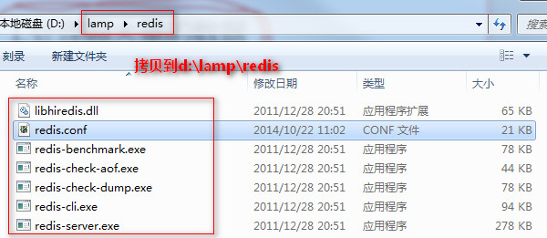

Redis是一个高性能的`key-value`形式存储的非关系型数据库，可以处理超大量的数据，并且可以运行在便宜的PC服务器集群上，还有它击碎了性能瓶颈，对数据高并发读写的特点奠定了Redis很受欢迎的基础。

下面，我们简单总结下如何在windows搭建Redis的环境以及简单的操作，Linux下环境的搭建请往下看。

下载地址：`https://github.com/dmajkic/redis/downloads`，下载下来的包里分为32位和64位系统使用，可根据自己的实际情况来挑选。

<!--more-->

###Windows下搭建环境

笔者使用的是Windows 64位，在D盘新建redis目录`d:\lamp\redis`,把下载下来的64位包里的文件全部拷贝到redis目录下。

接下来，在cmd控制台下切换到redis目录下，执行：

	redis-server.exe redis.conf

注意，不写`redis.conf`文件，会默认在该目录下寻找该文件。会出现如下图界面：

**注意**

此时表示服务器开始成功，一定不要关闭该控制台，否则后面就无法连接成功了！！！

接下来，重新开启一个cmd控制台，切换到redis目录，执行:

	redis-cli.exe -h 127.0.0.1 -p 6379

会出现如下界面：

此时，表示redis连接成功了。我们可以在`redis.conf`中配置：

	port 6379			//端口
	bind 127.0.0.1 		//环回网络

此时，就不用添加`-h -p`参数了,使用`redis-cli.exe `即可连接成功。

下面，我们来测试下，在redis命令行，输入：

	set aa "I Love Redis"

打印输出：

	get aa

此时，即可看到刚才设置的"I Love Redis"字符串。

更多关于Redis的设置项，请参考`redis.conf`文件。

---

###Linux下搭建环境

首先，下载Redis安装包：

	wget http://download.redis.io/releases/redis-2.8.17.tar.gz

接下来创建redis安装文件

	mkdir -p /var/local/redis/etc
	mkdir -p /var/local/redis/bin

然后，开始安装redis：

	tar -zxvf redis-2.8.17.tar.gz
	cd ./redis-2.8.17
	make

接下来：

	cp redis-benchmark redis-check-aof redis-check_dump  redis-cli redis-server /var/local/redis/bin
	cp ../redis.conf /var/local/redis/etc

然后，切换到`/var/local/redis/etc`,打开`redis.conf`文件，配置如下：

	daemonize yes	//后台运行
    bind 127.0.0.1		

到此，redis就配置完毕。

接下来，测试下,先运行redis服务：

	/var/local/redis/bin/redis-server /var/local/redis/etc/redis.conf

使用netstat查看下：

	netstat -tunpl | grep redis

说明redis服务已经运行成功。

下面，打开使用redis：
	
	/var/local/redis/bin/redis-cli 
	

（end）

	

