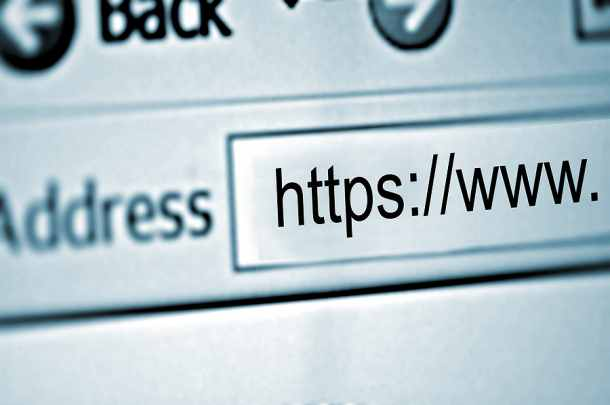
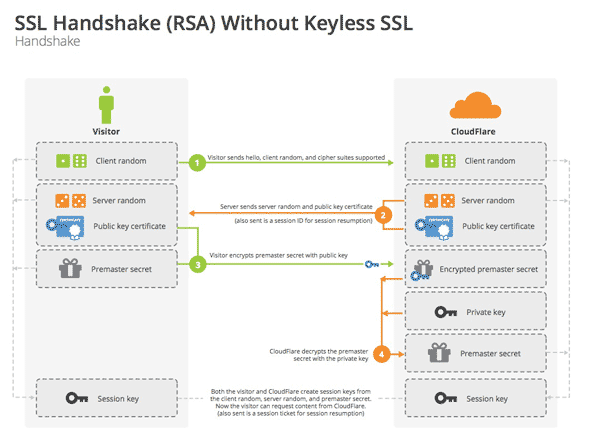

不使用SSL/TLS协议的HTTP通信，就是不加密的通信，所有信息都是明文传播。在这个不安全的网络上，当我们涉及金钱的交易时，如果信息使用明文传输，光是想想都觉得可怕（假如支付宝使用明文的HTTP协议，你还敢使用吗？）。

信息使用铭文传输，有三大风险：

*	窃听风险：第三方可以获知通信内容。
*	篡改风险：第三方可以修改通信内容。
*	冒充风险：第三方可以冒充他人身份参与通信。

SSL/TLS协议是为了解决这三大风险而设计的，希望达到：

<!--more-->

*	所有信息都是加密传播，第三方无法窃听。
*	具有校验机制，一旦被篡改，通信双方会立刻发现。
*	配备身份证书，防止身份被冒充。

互联网是开放环境，通信双方都是未知身份，这为协议的设计带来了很大的难度。而且，协议还必须能够经受所有匪夷所思的攻击，这使得SSL/TLS协议变得异常复杂。

**SSL/TLS协议的基本过程是这样的：**

1、	客户端向服务器端索要并验证公钥。

2、	双方协商生成"对话密钥"。

3、  双方采用"对话密钥"进行加密通信

上面过程的前两步，又称为"**握手阶段**"。"握手阶段"涉及四次通信，需要注意的是，**"握手阶段"的所有通信都是明文的**。

###SSL协议的握手过程

开始加密通信之前，客户端和服务器首先必须建立连接和交换参数，这个过程叫做握手。

握手阶段分成五步：

1、客户端给出协议版本号、一个客户端生成的随机数（Client random），以及客户端支持的加密方法。

2、服务器确认双方使用的加密方法，并给出数字证书、以及一个服务器生成的随机数（Server random）。

3、客户端确认数字证书有效，然后生成一个新的随机数（Premaster secret），并使用数字证书中的公钥，加密这个随机数，发给服务器。

4、服务器使用自己的私钥，获取客户端发来的随机数（即Premaster secret）。

5、客户端和服务器根据约定的加密方法，使用前面的三个随机数，生成**"对话密钥"**（session key），用来加密接下来的整个对话过程。

###私钥的作用

握手阶段有三点需要注意:

*	生成对话密钥一共需要三个随机数。
*	握手之后的对话使用**"对话密钥"**加密（对称加密），服务器的公钥和私钥只用于加密和解密"对话密钥"（非对称加密），无其他作用(**注意**)。
*	服务器公钥放在服务器的数字证书之中。

从上面第二点可知，整个对话过程中（握手阶段和其后的对话），服务器的公钥和私钥只需要用到一次，后面的对话都不再会用到私钥了。

###服务器的最后回应

服务器收到客户端的第三个随机数之后，计算生成本次会话所用的**"会话密钥"**。

至此，整个握手阶段全部结束。接下来，客户端与服务器进入加密通信，就完全是使用普通的HTTP协议，只不过用"会话密钥"加密内容。

**特此声明：**

本文主要参考[阮一峰老师的个人博客](http://www.ruanyifeng.com/home.html),特此感谢！

参考链接：[SSL/TLS协议运行机制的概述](http://www.ruanyifeng.com/blog/2014/02/ssl_tls.html)

参考链接：[图解SSL/TLS协议](http://www.ruanyifeng.com/blog/2014/09/illustration-ssl.html)

（end）
