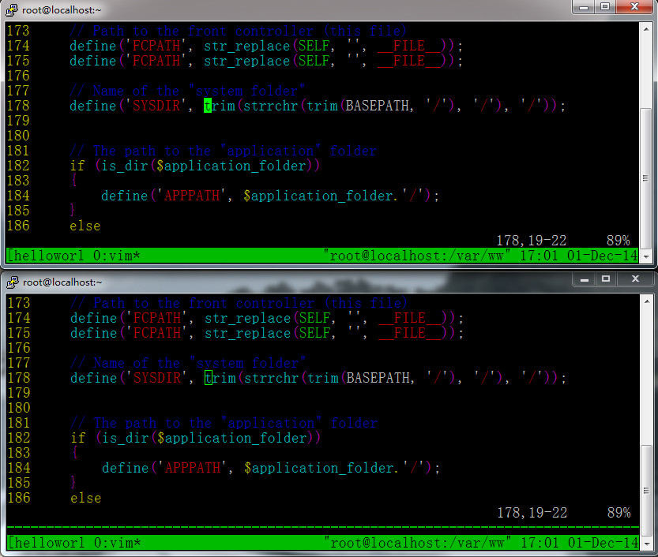

本来计划是一天总结一篇Tmux使用技巧的，但是现在真的忍不住要提前介绍一个更炫酷的关于使用Tmux的技巧了，哈哈，技术控嘛，碰到新鲜的而自己又喜欢的技术肯定是不会放过的，破例一下。

Tmux另一个很潇洒的应用技巧是**结对编程**。比如说有一个场景，一个程序猿叫hello在北京，另一个程序媛叫world在上海，他们两个现在要对他们共同开发的项目进行代码讨论。解决这个需求，我们当然可以使用桌面共享工具来把他们各自的桌面图形界面分享给彼此，但是由于网速的原因，这样做的效果并不是很好。

<!--more-->

下面来介绍如何使用Tmux来高效的完成相同的工作。首先，我们让用户hello使用ssh登录到我们的远程服务器（这里使用VMware来测试），并创建名叫`helloworld`的会话：

	tmux new -s helloworld
	//打开一个测试文件index.php
	vim index.php

然后，使用户world也登录同样的服务器（本地虚拟机测试），并加入hello创建的`helloworld`会话：

	tmux attach -t hellowrld

然后他们，就可以通过语音来共同研究代码了，每当其中一个用户对代码进行修改时，同时另一个用户就会看到同样的显示。由于两个用户传递的是纯文本字符串，网速对其影响也不大，效果也很好。附上一张效果图，勿喷：

所以，我们使用耳麦语音通话再配合上我们潇洒的Tmux来结对编程，效果会非常的理想，不管做啥都 so easy，妈妈再也不用担心我敲代码了，哈哈。

