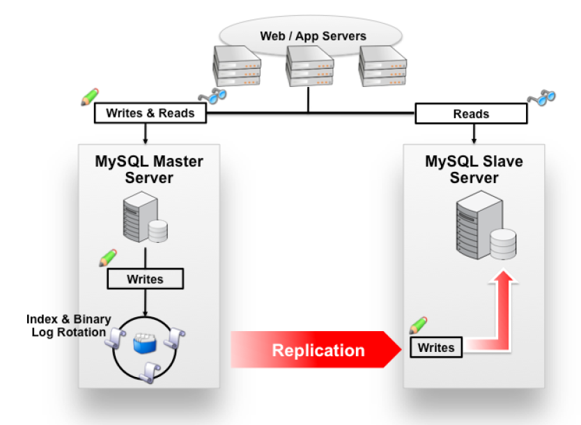
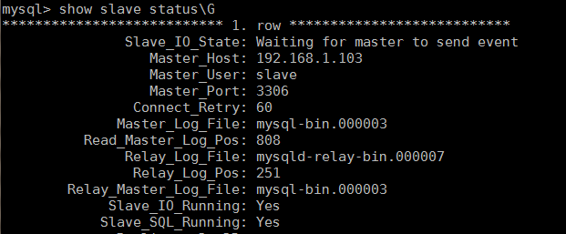

MySQL数据库主从复制的工作方式很简单，一台主机作为主服务器，一台或者多台主机作为从服务器。主服务器会把数据库的变化记录到日志，一旦这些变化被记录到日志，就会马上或者以固定的时间间隔被发送从服务器，使得主从服务器得到同步。

下面，总结下主从服务器配置原理，作为笔记，首先说明下测试环境（局域网内）：

	Centos 6.5 主 192.168.1.103 (VMware测试)
	Centos 6.5 从 192.168.1.104 (VMware测试)
	MySQL 5.4

<!--more-->

###MySQL主从复制优点

>* 如果主服务器出现问题，可以快速切换到从服务器提供的服务
>* 可以在从服务器上执行查询操作，降低主服务器的访问压力
>* 可以在从服务器上执行备份，以避免备份期间影响主服务器的服务

**注意**

一般只有更新不频繁的数据或者对实时性要求不高的数据可以通过从服务器查询，对于实时性要求高的数据仍然要从主服务器上获得。

在正式开始配置前，先看下摘自网上的一个简单完整的 Mysql 主从复制，读写分离的示意图。

###主服务器配置

1、登录数据库

	mysql -u root -p *** test

2、给从服务器设置授权用户

	mysql>grant all slave on *.* to slave@192.168.1.104 identified by '123456';
	mysql>flush privileges

3、修改主服务器配置文件`my.cnf`:

	vim /etc/my.cnf
	server-id  = 1   		 #主机标示，整数
	log_bin    = mysql-bin   #开启bin-log
	service mysqld restart   #注意：更改mysql配置文件后一定要重新启动mysqld服务

4、在主服务器上设置读锁定有效，确保没有数据库操作，以便获得一个一致性的快照。

	mysql>flush tables with read lock;

5、目前主服务器已经停止了更新操作，生成主数据库的备份方式有两种：

>* cp全部的数据文件到从服务器
>* mysqldump备份数据方式

*如果数据库的服务可以停止的话，那么直接使用cp复制数据文件应该是最快的生成快照的方法了。*

这里使用mysqldump备份数据文件：

	mysqldump -uroot -p*** test > /tmp/test.sql
	

6、主数据库备份完毕后，主数据库要进行解锁操作：

	mysql>unlock tables;

7、把数据库备份的一致性文件复制到从服务器,并在从数据库导入数据：

	scp /tmp/test.sql 192.168.1.104:/tmp/		//复制到从服务器	
	mysqldump -uroot -p*** test < /tmp/test.sql

###从服务器配置

1、修改从服务器数据库的server-id,注意从数据库的server-id的值必须是唯一的，不能和主数据酷的配置相同，如果有多个从服务器，则每个服务器必须有自己唯一的server-id值。

	vim /etc/my.cnf
	//下面是从数据库的配置
	server-id = 2
	master-host     = 192.168.1.103		//注意：这里是主服务器ip
	master-user     = slave				//从数据库用户
	master-password = 123456
	master-port     = 3306
	master-connect-retry=60 		     //如果从服务器发现主服务器断掉，重新连接的时间差(秒)
	replicate-do-db =test                //只复制某个库
	replicate-ignore-db=mysql            //不复制某个库
	service mysqld restart				 //重新启动mysqld服务

2、在从数据库内开启slave进程：

	mysql>start slave;

3、在从数据库进行`show slave status\G`进行查看从服务器是否配置成功：

4、从数据库常用命令：

	start slave			//启动复制线程
	stop  slave 		//停止复制线程
	show  slave  status //查看从数据库状态
	show master logs    //查看主数据酷bin-log日志
	change master to    //动态改变主服务器配置
	show processlist    //查看数据库运行进程

5、现在可以在主数据库进行一些insert、update和delete操作，看看从数据库是不是已经同步完成，答案是肯定的啦。 :)

（end）

