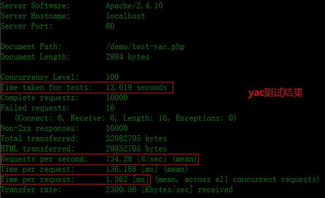
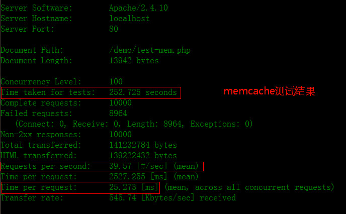

这几天一直在研究鸟哥[@laruence](http://weibo.com/laruence)的一个产品---**Yac**，它是为PHP实现的一个基于共享内存、并且无锁的User Data Cache。今天比较了下Memcache和Yac的高并发读写性能测试，发现Yac要比Memcache快很多（这里没有比较Yac和Apc的性能情况, 不过据说Yac要比Apc快很多，Apc比Memcache快一倍，待有时间再进行测试吧, 好吧，承认懒了 ^_^)。

<!--more-->

首先说下，Yac是无锁的、共享内存的Cache，因此可以减少CPU的消耗，这个本人确实有体会，而Memcache压力测试时CPU直接飙升到 ~100%，汗。

另外，Yac的安装是很方便的，而且在windows下支持是灰常好滴，想学习的同学可以参考鸟哥[@laruence](http://weibo.com/laruence)的博客：

[http://www.laruence.com/2013/03/18/2846.html](http://www.laruence.com/2013/03/18/2846.html)

github 地址：[https://github.com/laruence/yac](https://github.com/laruence/yac)

下面简单介绍下安装：

	wgethttps://pecl.php.net/get/yac-0.9.2.tgz
	tar -zxvf yac-0.9.2.tgz
	cd yac-0.9.2
	phpize
	./config --prefix=/usr/local/yac --with-php-config=/usr/local/php/bin/php-config
	sudo make && make install

接下来配置php.ini文件：

	vim /etc/php.ini
	//添加一下内容
	extension=php-yac.so
	[yac]
	yac.enable = 1					//是否开启yac，1表示开启， 0表示关闭
	yac.keys_memory_size = 4M		//4M可以得到32768个key， 32M可以得到262144个key
	yac.values_memory_size = 64M	//申请的最大value内存
	yac.compress_threshold = -1		//是否压缩数据
	yac.enable_cli = 0				//关闭在cli下使用yac

最后重启Web Server服务器即可， windows下面安装yac扩展网上教程一大推，自己去搜索吧，这里不再赘余。。。

###Yac的应用场景

1.	让PHP进程之间共享一些简单的数据
2.	高效地缓存一些页面结果

###Yac的限制

1.	 缓存的键长度不能超过48字节，太长的话可以md5结果后再使用
2.	Value的最大长度不能超过64M，压缩后的长度不能超过1M
3.	当内存不够的时候, Yac会有比较明显的踢出率 (所以如果要使用Yac, 那么尽量多给点内存...)

###Yac vs Memcache

下面对Yac和Memcache进行性能比较：

yac测试代码：

	//test-yac.php
	<?php
		$yac = new Yac();
		for($i = 1; $i <= 100; $i++){
    		$key = 'key_' . $i;
    		$value = mt_rand(0, 10000);
    		if( ! $yac->set($key, $value))
        		var_dump("Yac set error: $key --> $value");
		}

		for($i = 1; $i <= 100; $i++){
    		$key = 'key_' . $i;
    		$value = $yac->get($key);
    		if($value === false){
        		var_dump("Yac get error: $key not found");
    		}
		}
	?>

memcache测试代码：

	//test-mem.php
	<?php
		$mem = new Memcache();
		$mem->connect('localhost', 11211) or die('memcache connected error...');

		for($i = 1; $i <= 100; $i++){
    		$key = 'key_' . $i;
    		$value = mt_rand(0, 10000);
    		if( ! $mem->set($key, $value))
        		var_dump("Memcache set error: $key --> $value");
		}

		for($i = 1; $i <= 100; $i++){
   			$key = 'key_' . $i;
    		$value = $mem->get($key);
    		if($value === false){
        		var_dump("Memcache get error: $key not found");
    		}
		}
	?>
然后对test-yac.php和test-mem.php文件分别进行ab压力测试：

	ab -n 10000 -c 100 http://localhost/demo/test-yac.php

	ab -n 10000 -c 100 http://localhost/demo/test-mem.php

从上面的图中，相信大家可以看出结论了，Yac要比Memcache快很多，而且出错率很低，所以说Yac还是很不错的。

---

###小结

Yac固然很高效，但还是要注意一些方面，由于Yac是作为PHP的扩展形式存在的，所以Yac只能在单机的多个进程之间共享缓存的，这一点一定要注意。而在真实的生产环境下，由于服务器有很多，并且有可能是作为分布式集群形式存在，那个时候使用Memcache缓存服务器集群还是更好的选择（或者使用其他分布式缓存数据库，比如Redis等NoSQL非关系型数据库）。

（end）

