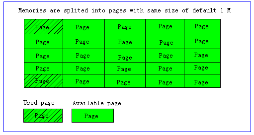
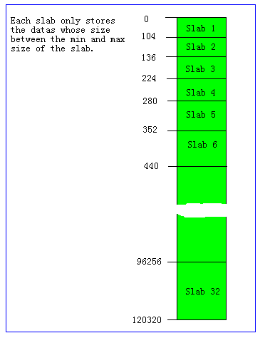
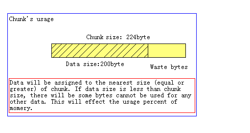
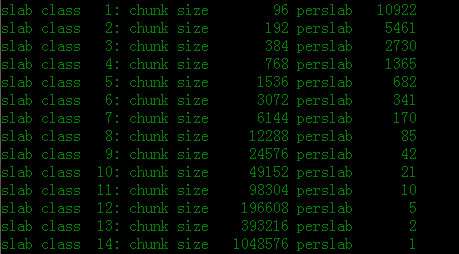
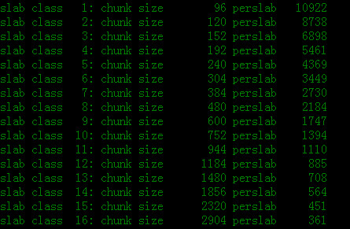

首先，我们要明白什么是**内存的碎片化**，要解释这个也不困难。大概可以这样描述，如果用c 语言直接`malloc`,`free` 来向操作系统申请和释放内存时,在不断的申请和释放过程中,形成了一些很小的内存片断,无法再利用.这种空闲,但无法利用内存的现象,即被称为**内存的碎片化**.

<!--more-->

##Page为内存分配的最小单位

Memcached的内存分配以page为单位，默认情况下一个page是1M，可以通过-I(大写字母i)参数在启动时指定。如果需要申请内存 时，memcached会划分出一个新的page并分配给需要的slab区域。需要注意的是，**page一旦被分配在重启前不会被回收或者重新分配**。

##slab allocator缓解内存碎片化

Memcached并不是将所有大小的数据都放在一起的，而是预先将数据空间划分为一系列slabs，每个slab只负责一定范围内的数据存储。如 下图，每个slab只存储大于其上一个slab的chunk并小于或者等于自己最大chunk的数据。例如：slab 3只存储大小介于137 到 224 bytes的数据。如果一个数据大小为230byte将被分配到slab 4中。从下图可以看出，每个slab负责的空间其实是不等的，memcached默认情况下下一个slab的chunk最大值为前一个的1.25倍，这个可以通过修改`-f`参数来修改增长比例。 

##Chunk才是存放缓存数据的单位

memcache把申请到的每个slab仓库按照需要切分成不同的小块（chunk）来存储数据。Chunk是一系列固定的内存空间，这个大小就是管理它的slab的最大存放大小。例如：slab 1的每个chunk都是104byte，而slab 4的每个chunk都是280byte。chunk是memcached实际存放缓存数据的地方，因为chunk的大小固定为slab能够存放的最大值， 所以所有分配给当前slab的数据都可以被chunk存下。如果时间的数据大小小于chunk的大小，空余的空间将会被闲置，这个是为了防止内存碎片而设 计的。例如下图，chunk size是224byte，而存储的数据只有200byte，剩下的24byte将被闲置。

###注意：

如果有100byte 的内容要存,但122 大小的仓库中的chunk 满了，并不会寻找更大的,如144 的仓库来存储,而是把122 仓库的旧数据踢掉! 这个会在后面的memcache过期与删除机制那部分介绍。

##grow factor调优

由于slab allocator 机制中, 分配的chunk 的大小是”固定”的, 因此,对于特定的item，可能造成内存空间的浪费.比如, 将100 字节的数据缓存到122 字节的chunk 中, 剩余的22 字节就浪费了，是吧。那怎么办？

对于chunk 空间的浪费问题,无法彻底解决,只能缓解该问题.开发者可以对网站中缓存中的item 的长度进行统计,并制定合理的slab class 中的chunk 的大小.

可惜的是,我们目前还不能自定义chunk 的大小,但可以通过参数来调整各slab class 中chunk
大小的增长速度. 即增长因子, grow factor!

memcached 在启动时可以通过`f`选项指定Growth Factor增长因子, 并在某种程度上控制slab 之
间的差异. 默认值为1.25. 但是,在该选项出现之前,这个因子曾经固定为2,称为”powers of 2”
策略。
我们分别用grow factor 为2 和1.25 来看一看效果:

	> memcache -m 64 -p 11211 -f 2 -vvv

可以看到，从96 字节的chunk组开始，chunk组的大小依次增大为原来的2 倍.

下面看看`f = 1.25`时的输出

	> memcache -m 64 -p 11211 -f 1.25 -vvv

对比可知, 当f=2 时, 各slab 中的chunk size 增长很快,有些情况下就相当浪费内存.
因此,我们应细心统计缓存的大小,制定合理的增长因子.

###注意：

当f=1.25 时,从输出结果来看,某些相邻的slab class 的大小比值并非为1.25,可能会觉得有些
计算误差，这些误差是为了保持字节数的对齐而故意设置的.

---

##小结:

综合上面的介绍，memcached的内存分配策略就是：

1、按slab需求分配page

2、各slab按需使用chunk存储

这里有几个特点要注意：

**Memcached分配出去的page不会被回收或者重新分配，Memcached申请的内存不会被释放，slab空闲的chunk不会借给任何其他slab使用**。