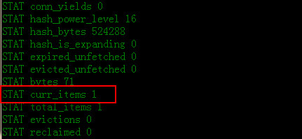
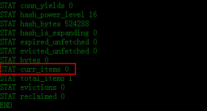

Memcache是缓存，所以数据不会永久保存在服务器上，这也是在服务器上引进Memcache的前提。当我们在memcache中存放数据时会设置超时时间（不设置，默认为永久有效，但不排除会被新数据剔除的可能性），那么当到达超时时间时memcache是如何做到删除数据的呢？这里需要引入**Lazy Expiration**即惰性失效的概念。  

<!--more-->

##过期数据的惰性删除

首先，我们在memcache中存入测试数据：

	telnet 127.0.0.1 11211 //使用telnet做连接测试
	>add aa 0 10 
	>test

此时，我们存入了一个key为aa的测试数据，并且设置超时时间是10s。

等待10s......滴答滴答......

这时候，我们使用`stats`命令在telnet下查看运行状态：

我们发现，当某个值过期后,并没有从内存删除, 因此,stats 统计时, curr_item仍有其信息。此时，我们使用命令`get`后，再次stats查看信息，发现内存中已经没有该信息了，也就是说被删掉了。如下图：

因此，我们可以总结如下：

1、 当某个值过期后,并没有从内存删除, 因此,stats 统计时, curr_item 有其信息.

2、 当某个新值去占用他的位置时,当成空chunk 来占用.

3、 当get 值时,判断是否过期,如果过期,返回空,并且清空, curr_item 就减少了.

所以，这个时期，memcached内部不会监视记录是否过期，memcache只是让用户看不到数据而已，并没有在过期的瞬间立即从内存删掉数据，而是在get时查看记录的时间戳，检查记录是否过期,这种技术被称为**Lazy Expiration**， 也就是惰性失效。

那么，有什么好处呢？

好处就是节省了CPU的时间和检测成本。

##LRU删除机制

如果以122byte 大小的chunk举例, 122 的chunk 都满了, 又有新的值(例如长度为120)要加入, 要
挤掉谁?

memcache会优先使用已超时的记录的空间，即便如此，也会出现追加新纪录时空间不足的情况，那该怎么办呢？此时，memcache就要使用名为"LRU"(Least Recently Used, 最近最少使用)机制来分配空间。因此，当memcached的内存空间不足时（无法从slab class 获取到新的空间时），就从最近未被使用的记录中搜索，并将其空间分配给新的记录。

**原理:** 

> 当某个单元被请求时,维护一个计数器,通过计数器来判断最近谁最少被使用.就把谁剔除。

需要**注意**的是: 即使某个key 是设置的永久有效期,也一样会有被踢出来的可能!即**永久数据被踢现象**。这个会在后面总结。

不过，有些情况下LRU机制反倒会造成麻烦。memcached启动时通过`-M`参数可以禁止LRU，如下所示：
	
	$ memcached -M -m 1024

启动时必须注意的是，小写的“-m”选项是用来指定最大内存大小的。不指定具体数值则使用默认值64MB。

指定`-M`参数启动后，内存用尽时memcached会返回错误。话说回来，memcached毕竟不是存储器，而是缓存，所以推荐使用LRU。

(end)