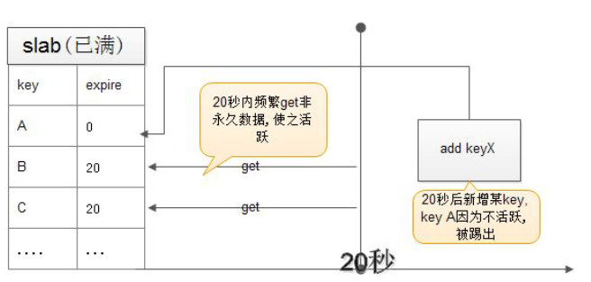

有时候，在我们使用memcache过程中会出现"数据丢失"的现象， 也就是说明明数据被设为永久有效，却莫名其妙的丢失了，这是怎么回事呢？

在上一篇博客[Memcache过期数据惰性和LRU删除机制](http://liyafeng.cn/memcache_item_delete_note/)中已经总结了memcache过期数据是如何被删除的以及根据LRU（最近最少使用机制）来从最近未被使用的记录中搜索，并将其空间分配给新的记录。

<!--more-->

所以，遇到这种情况我们只需要从以上两方面来分析，即可得到以下结论：

1、如果Slab中的很多chunk尚未过期， 且非永久数据比较活跃，此时新增item，则永久数据被踢；

2、如果Slab中的很多chunk已经过期， 且过期前比较活跃以及过期后未被get过，系统不知道他们已经过期，此时新增item， 则永久数据被踢；

3、如果Slab中的很多chunk已经过期，且被get过，被标记为expire(过期)，此时新增item，则永久数据不会被踢；

用图表示如下：

避免永久数据被踢现象的解决方案：

> 永久数据和非永久数据分开放，具体如何设计，看具体环境。

(end)

